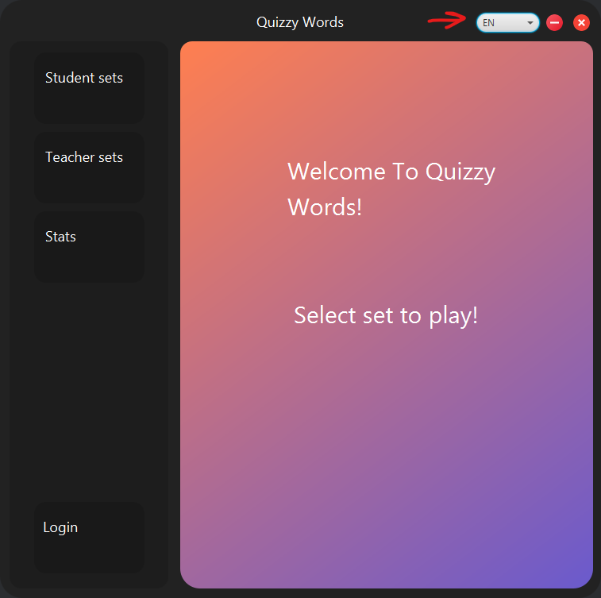

# Quizzy Cards

## Overview
Quizzy Cards is a flashcard app for teachers and students, offering interactive environment to create flashcard sets and study.

The project is implemented in Java using Maven.

## Key Features
- Students can create and review custom flashcards and sets
- Teachers can upload and share flashcard sets
- Progress tracking and statistics for students
- Analytics for teachers
- Localization

## Technology Stack
- Java
- JavaFX
- MariaDB
- Maven
- JUnit 5
- Mockito
- Docker
- Jenkins
- Resource Bundles

### Why this stack?
- Java for good performance
- JavaFX for visually appealing and interactive UI
- MariaDB for reliable and scalable database management
- Maven for dependency management and build automation
- JUnit 5 for testing the code and making sure it works correctly
- Mockito for testing purposes (creating mock objects and dependencies)
- Docker for building, portability and deployment
- Jenkins for CI and CD purposes
- Resource Bundles for easy localization

## Methodology
Agile

## Shade Plugin
The project creates JAR file with all dependencies included using the Maven Shade Plugin. After `mvn clean install` there will be a file target/*.jar

## Localization

We used basic Resource bundles (MessagesBundle) and java locales to create localization for Russian and Japanese in addition to English.

- Russian was translated using native Russian speaker
- Japanese was translated using Google translate

## Setup and Installation

1. **Clone the repository**
   ```bash
   git clone https://github.com/jarmoil/OTP1
   cd OTP1 
   ```

2. **Configure the Database**
   - Ensure MariaDB is installed and running.
   - Create a database named `flashcardDB` and run db_backup.sql file in the resource directory
   - Or you can use the docker-compose.yml file to run the MariaDB container which is in the root directory of the project
   ```bash
   cd docker
   docker-compose -f docker-compose.yml up --build 
   ```

3. **Set environmental variables if not using docker-compose.yml**
   - Create db.properties in the project main\resources folder
       ```env
     DB_HOST=mariadb
     DB_PORT=3306
     DB_NAME=flashcardDB
     DB_USER=${DB_USER}
     DB_PASSWORD=${DB_PASSWORD}
     ```

4. **Build the project**
    ```bash
    mvn clean install
    ```   

5. **Run the application**
   ```bash
    mvn javafx:run
   ```
## Running Tests

The project includes tests for all the layers and to run it use this command:

```bash 
mvn clean test
```

## Project Structure

- src/main/java: Contains the main application code.
- src/test/java: Contains the test code.
- src/main/resources: Contains config and styling files.
- docker-compose.yml Contains docker compose configuration.
- Jenkinsfile: Contains the Jenkins pipeline configuration.
- resources/*.sql: Contains older and newer versions of database.
- pom.xml: Contains the Maven project configuration.
- Dockerfile: Contains Docker image configuration.
- src/main/resources/db.properties: database config.

## Jenkins Setup

**Install Jenkins:** Download and install Jenkins from the official website.

**Configure Jenkins:**
- Install necessary plugins (e.g., Docker, Maven).
- Set up credentials for Docker Hub.
- Create Jenkins Pipeline:
- Use the provided Jenkinsfile to create a pipeline job in Jenkins.

**Push to Docker Hub**

Push to docker hub through Jenkins pipeline. Docker Hub Repository: [Docker Hub](https://hub.docker.com/repository/docker/jarmoillikainen/otp1_quizcard/general)

**Docker Play with Jenkins**
**Pull Docker Image:**
```bash
docker pull jarmoillikainen/otp1_quizcard:v1
```

## Running the Application with Docker

**Use the same environment variables as earlier**

And if you are running the application locally, the application automatically loads the default .env file and connects to the localhost.

**Build Docker Image:**

```bash
docker compose up --build
```

This will build everything and also make docker-compose.yml do its job

**Check Docker Images:**
```bash
docker images
```

**Push the Docker Image to Docker Hub:**

If you want to push your image to docker hub locally, you can use the following command (make adjustments if needed):
```bash
docker push jarmoillikainen/otp1_quizcard:v1
```

**Pull the Docker Image from Docker Hub:**

Using same command except swapping push to pull will do the job

## Changing languages in the application (localization)

**Explanation**

Press the button the red arrow points to in the screenshot below:



That will open menu to choose from Japan (Ja), Russian (Ru) and English (EN) which is default.

The rest of the application works the same.