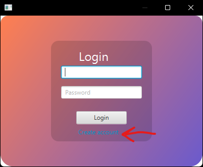
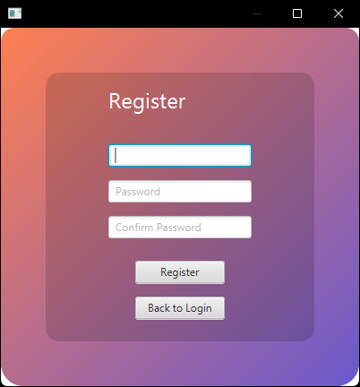
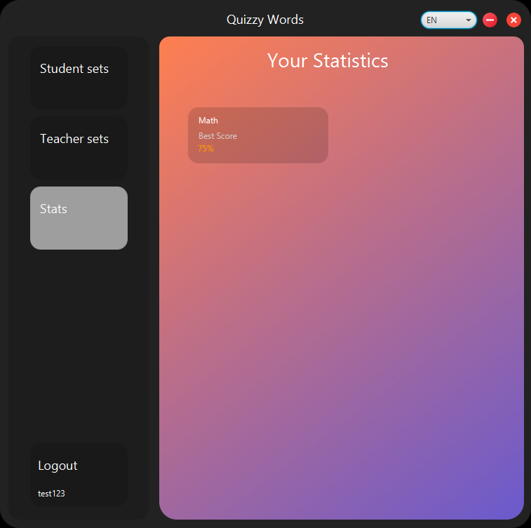
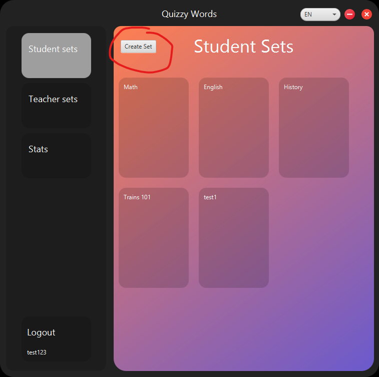
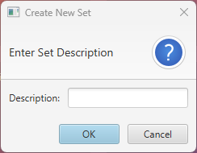
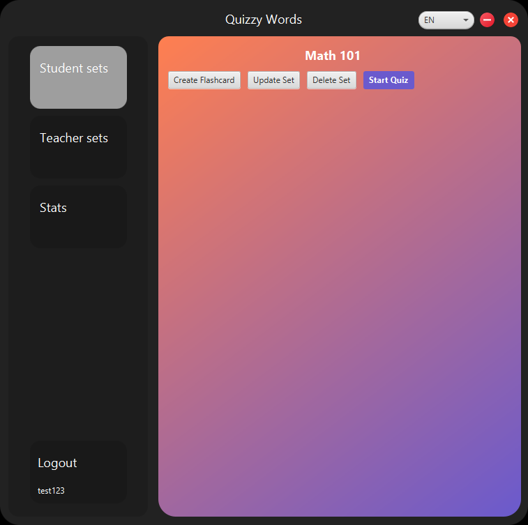
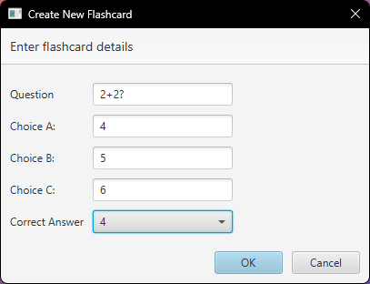
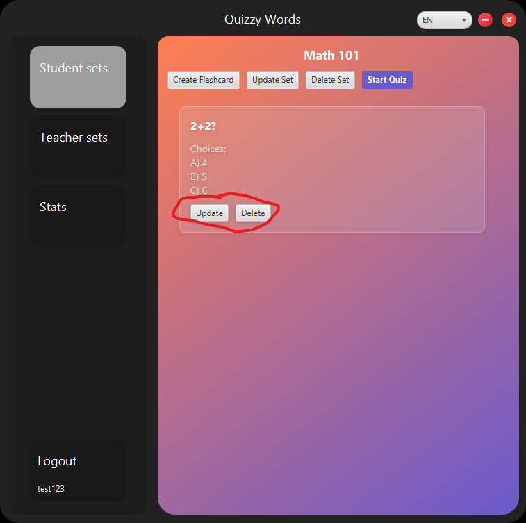
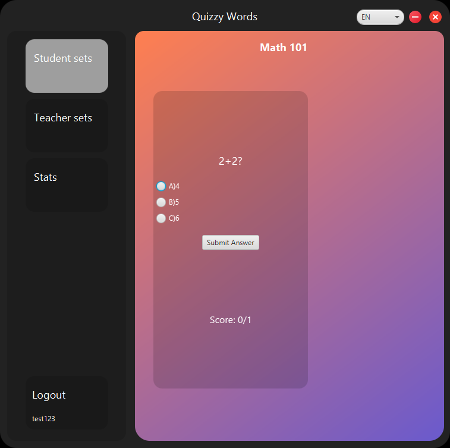

# Quizzy Cards

## Overview
Quizzy Cards is a flashcard app for teachers and students, offering interactive environment to create flashcard sets and study.

The project is implemented in Java using Maven.

## Key Features
- Students can create and review custom flashcards and sets
- Teachers can upload and share flashcard sets
- Progress tracking and statistics for students
- Analytics for teachers
- Localization

## Technology Stack
- Java
- JavaFX
- MariaDB
- Maven
- JUnit 5
- Mockito
- Docker
- Jenkins
- Resource Bundles
- SonarQube
- SpotBugs
- JMeter

### Why this stack?
- Java for good performance
- JavaFX for visually appealing and interactive UI
- MariaDB for reliable and scalable database management
- Maven for dependency management and build automation
- JUnit 5 for testing the code and making sure it works correctly
- Mockito for testing purposes (creating mock objects and dependencies)
- Docker for building, portability and deployment
- Jenkins for CI and CD purposes
- Resource Bundles for easy localization
- SonarQube and SpotBugs for security and code testing
- JMeter for performance testing

## Methodology
Agile

## Shade Plugin
The project creates JAR file with all dependencies included using the Maven Shade Plugin. After `mvn clean install` there will be a file target/*.jar

## Localization

We used basic Resource bundles (MessagesBundle) and java locales to create localization for Russian and Japanese in addition to English.

- Russian was translated using native Russian speaker
- Japanese was translated using Google translate
- Farsi was translated using Google translate

## Setup and Installation

1. **Clone the repository**
   ```bash
   git clone https://github.com/jarmoil/OTP1
   cd OTP1 
   ```

2. **Configure the Database**
   - Ensure MariaDB is installed and running.
   - Create a database named `flashcardDB` and run db_backup.sql file in the resource directory
   - Or you can use the docker-compose.yml file to run the MariaDB container which is in the root directory of the project
   ```bash
   cd docker
   docker-compose -f docker-compose.yml up --build 
   ```

3. **Set environmental variables if not using docker-compose.yml**
   - Create db.properties in the project main\resources folder
       ```env
     DB_HOST=mariadb
     DB_PORT=3306
     DB_NAME=flashcardDB
     DB_USER=${DB_USER}
     DB_PASSWORD=${DB_PASSWORD}
     ```

4. **Build the project**
    ```bash
    mvn clean install
    ```   

5. **Run the application**
   ```bash
    mvn javafx:run
   ```
## Running Tests

The project includes tests for all the layers and to run it use this command:

```bash 
mvn clean test
```

## Project Structure

- src/main/java: Contains the main application code.
- src/test/java: Contains the test code.
- src/main/resources: Contains config and styling files.
- docker-compose.yml Contains docker compose configuration.
- Jenkinsfile: Contains the Jenkins pipeline configuration.
- resources/*.sql: Contains older and newer versions of database.
- pom.xml: Contains the Maven project configuration.
- Dockerfile: Contains Docker image configuration.
- src/main/resources/db.properties: database config.

## Jenkins Setup

**Install Jenkins:** Download and install Jenkins from the official website.

**Configure Jenkins:**
- Install necessary plugins (e.g., Docker, Maven).
- Set up credentials for Docker Hub.
- Create Jenkins Pipeline:
- Use the provided Jenkinsfile to create a pipeline job in Jenkins.

**Push to Docker Hub**

Push to docker hub through Jenkins pipeline. Docker Hub Repository: [Docker Hub](https://hub.docker.com/repository/docker/jarmoillikainen/otp1_quizcard/general)

**Docker Play with Jenkins**
**Pull Docker Image:**
```bash
docker pull jarmoillikainen/otp1_quizcard:v1
```

## Running the Application with Docker

**Use the same environment variables as earlier**

And if you are running the application locally, the application automatically loads the default .env file and connects to the localhost.

**Build Docker Image:**

```bash
docker compose up --build
```

This will build everything and also make docker-compose.yml do its job

**Check Docker Images:**
```bash
docker images
```

**Push the Docker Image to Docker Hub:**

If you want to push your image to docker hub locally, you can use the following command (make adjustments if needed):
```bash
docker push yourusername/otp1_quizcard:v1
```

**Pull the Docker Image from Docker Hub:**

Using same command except swapping push to pull will do the job

# Tutorial on the app usage

Menu on the left is how you navigate through the app and there's no such thing as go back buttons, just press on the window you want to go back to.

## Changing languages in the application (localization)

**Explanation**

Press the button the red arrow points to in the screenshot below:


That will open menu to choose from Japan (Ja), Russian (Ru) Farsi (Fa) and English (EN) which is default.

The rest of the application works the same.

Localization method:

Database localization is done by checking the locale the user is using on the app and based on that, the flashcard set is stored in the database with a column indicating the language it was created in. 

The flashcard sets are then displayed on the app by which locale is chosen by the user. If the locale is Russian, only display flashcard sets that are in Russian etc.

## Account creation and features unlocked by it

### Account creation

Start by pressing Login button in the left bottom corner like shown in the screenshot below:


Then new window will be opened and there will be login form and below the form there'll be "create account" button (shown below) and press it and account creation will be opened



Then the window will be changed into account creation form:

- Come up with a username
- Come up with a safe password
- Write them down just in case
- Fill the form (shown below)
- Press Register and you can write your username and password and press login afterward.



### Features unlocked by having account

Some features are locked when you're using the app as a guest:

- Set creation
- Seeing your own stats

## Seeing your own stats

There's a big button on the left menu "Stats" when user is logged in and presses it, it will show your best score in quizzes you've played through. (screenshot below)



## Set creation, flashcard creation and updating

Press "Student sets" button, and you'll see "Create set" button only when logged in as a student and press it (teacher accounts only created by management, tutorial works same in teacher sets though)



New window will be opened and enter a name for the set you want it to have for example Math 101 (screenshot below).



It will throw you back into sets selection, and you'll have to select your own set.
After selecting your own set you'll have empty set with all the editing buttons at the top (screenshot below).



If you want to rename the set, you can press "Update Set" button, and it will show similar window when creating set.

When creating new flashcard you have to press "Create Flashcard" button. It will open new window with a form to fill (screenshot below).



If you want to update or delete that flashcard, you can press Update or Delete buttons on the flashcard.



You can keep doing all those changes until you're happy with the set and start playing quiz by pressing Start Quiz.

## Playing through a Quiz

Select Quiz you want to play and press "Start Quiz" button.

Then you'll have all the questions randomized and you'll have all questions showed one by one and you'll have to select answer and press "Submit Answer" (screenshot below).



## Logging out

To logout, just press "Logout" button at the bottom left in the app. It's always visible.